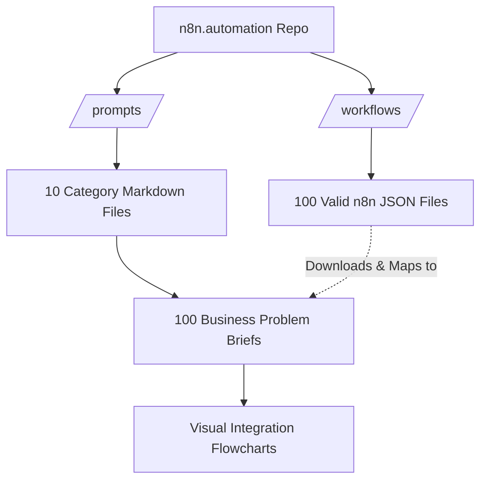

# 🚀 n8n.automation | Enterprise-Grade Automation Workflows

Welcome to **n8n.automation**, a curated repository of **100 fully-built, ready-to-import n8n workflows**. This library is designed to solve complex, enterprise-level business problems out of the box.

Whether you are an automation agency, a freelancer, or an enterprise architect, this repository gives you an instant portfolio of high-value solutions to pitch and deploy to your clients.

---

## 📑 Table of Contents
- [Architecture Overview](#-architecture-overview)
- [Directory of Automations](#-directory-of-automations)
- [How to Import Workflows](#-how-to-import-workflows)
- [Repository Structure](#-repository-structure)
- [Contributing](#-contributing)

---

## 🏗 Architecture Overview

The repository is built to cleanly separate the business logic (briefs) from the technical implementation (JSON workflows). 

---

## 📂 Directory of Automations

We've categorized 100 automated solutions across 10 critical enterprise domains. Click on any category below to view the business problems, explore the visual pipelines, and download the exact n8n JSON files.

| Category | Description | Link |
| :--- | :--- | :--- |
| **01. FinOps & Revenue** | Multi-currency revenue recognition, AP workflows, subscription dunning. | [View Automations](./prompts/01_finops_and_revenue.md) |
| **02. HR & Talent** | Automated onboarding, offboarding, performance reviews, internal mobility. | [View Automations](./prompts/02_hr_and_talent.md) |
| **03. Supply Chain** | Inventory POs, freight tracking, supplier scorecards, demand planning. | [View Automations](./prompts/03_supply_chain_and_logistics.md) |
| **04. Customer Success** | Product usage monitoring, ticket triage, QBR prep, churn intervention. | [View Automations](./prompts/04_customer_success.md) |
| **05. Sales & CRM** | Lead routing, CPQ, deal desk approvals, competitor pricing alerts. | [View Automations](./prompts/05_sales_and_crm.md) |
| **06. ITSM & DevOps** | Incident response, cloud cost optimization, vulnerability management. | [View Automations](./prompts/06_itsm_and_devops.md) |
| **07. Marketing Ops** | Webinar operations, ad spend reconciliation, content syndication. | [View Automations](./prompts/07_marketing_operations.md) |
| **08. Legal & Compliance** | NDA processing, DSAR workflows, vendor risk assessments. | [View Automations](./prompts/08_legal_and_compliance.md) |
| **09. Data Engineering** | ETL pipeline monitoring, data dictionary updates, schema evolution. | [View Automations](./prompts/09_data_engineering.md) |
| **10. Executive Ops** | Board deck creation, M&A data rooms, cap table management. | [View Automations](./prompts/10_executive_operations.md) |

---

## 📖 How to Import Workflows

Deploying these enterprise solutions to your own n8n instance takes less than 60 seconds.

1. **Find your Workflow**: Browse the `/prompts` directory to find the business problem you want to solve.
2. **Download the JSON**: Click the `📥 Download n8n JSON` link on the brief, or navigate to the `/workflows` directory and download the raw `.json` file.
3. **Import to n8n**:
   - Open your n8n workspace.
   - Click **Add Workflow** (or go to the Workflows screen).
   - Click the **...** (Options) menu in the top right of the canvas.
   - Select **Import from File** and upload the downloaded `.json`.
4. **Configure Credentials**: The nodes will automatically appear on the canvas perfectly connected! Double-click each integration node to add your specific API credentials.

---

## 🏗 Repository Structure

- **`/prompts`**: The master index of all 100 automations, complete with business briefs and visual architecture flowcharts.
- **`/workflows`**: The 100 generated `.json` workflow files, ready for import into n8n.
- **`/scripts`**: Internal Node.js scripts used in CI/CD to validate that all workflows are structurally sound.
- **`.github/workflows`**: Automated GitHub Actions ensuring no malformed JSONs or exposed credentials are merged.

---

## 🤝 Contributing

We welcome contributions from the enterprise automation community! 
Please read our [Contributing Guidelines](CONTRIBUTING.md) and our [Code of Conduct](CODE_OF_CONDUCT.md) before submitting a Pull Request.

---
*Built for automation architects who build for the enterprise.*
