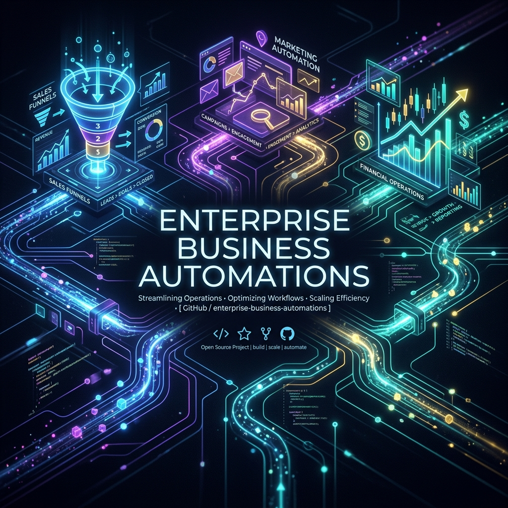

<div align="center">
  
  <br/><br/>
  
  # 🏢 50 Specific Business Problems Solved with n8n
  
  **Exact Problem & Solution Mappings for Enterprise Automations**
  
  [](https://n8n.io/)
  [](https://github.com/avuzmal/business.problems.n8n)
  
</div>

<hr/>

## 📖 The Vision

Instead of generic architectures, this repository outlines **50 highly specific, real-world business bottlenecks** across multiple departments. Each problem is paired with a distinct, ready-to-deploy **n8n automation solution**.

---

## ⚡ Quick Start

1. **Clone this repository**:
   ```bash
   git clone https://github.com/avuzmal/business.problems.n8n.git
   ```
2. **Open your n8n workspace**.
3. In a new or existing workflow, click the **Options** menu (top right) `>` **Import from File...**
4. Select any `.json` file from the `templates/` directory.

---

## 🗂️ Problem & Solution Catalog

### 📈 Marketing

| Workflow Name | The Problem | The n8n Solution |
|:---|:---|:---|
| **[Abandoned Cart Recovery](templates/001-abandoned-cart-recovery.json)** | High cart abandonment rates on e-commerce store with no follow-up. | Listen for abandoned cart webhooks, wait 1 hour, check if purchased, send targeted discount email via SendGrid. |
| **[Social Media Cross-Posting](templates/002-social-media-cross-posting.json)** | Manually posting the same content across Twitter, LinkedIn, and Facebook wastes time. | Trigger on new RSS feed item, format message with OpenAI, post to Buffer API for distribution. |
| **[Lead Enrichment from Forms](templates/003-lead-enrichment-from-forms.json)** | Inbound leads only provide email addresses, making qualification difficult. | Trigger on form submission, query Clearbit API for company data, update HubSpot CRM. |
| **[Competitor Pricing Alert](templates/004-competitor-pricing-alert.json)** | Competitors change prices without us knowing, leading to lost sales. | Daily cron, scrape competitor pricing page, compare to DB, alert Slack channel if changed. |
| **[Webinar Attendee Follow-up](templates/005-webinar-attendee-follow-up.json)** | No automated follow-up for users who attended but didn't convert. | Zoom webhook for webinar end, cross-reference CRM for deals, send personalized outreach sequence. |

<br/>

### 🤝 Sales

| Workflow Name | The Problem | The n8n Solution |
|:---|:---|:---|
| **[Contract Expiry Notification](templates/006-contract-expiry-notification.json)** | Sales team misses renewal dates, resulting in churn. | Daily cron queries Salesforce for contracts expiring in 30 days, creates task for Account Manager, sends email. |
| **[High-Intent Page Visitor Alert](templates/007-high-intent-page-visitor-alert.json)** | Sales reps don't know when a hot lead visits the pricing page. | Listen to segment events, filter for 'pricing' and 'logged in', alert account owner in Slack immediately. |
| **[Automated Proposal Generation](templates/008-automated-proposal-generation.json)** | Manually typing proposals takes hours per prospect. | Trigger when deal reaches 'Proposal' stage, fetch CRM data, populate Google Doc template, generate PDF, email. |
| **[Stale Lead Re-engagement](templates/009-stale-lead-re-engagement.json)** | Thousands of cold leads sit in the database with zero touchpoints. | Monthly cron queries leads untouched > 90 days, sends re-engagement plain-text email sequence. |
| **[Post-Demo Feedback Loop](templates/010-post-demo-feedback-loop.json)** | Sales managers have no visibility into how demos went. | Trigger 1 hr after calendar event 'Demo', send Typeform survey to prospect, push results to Slack channel. |

<br/>

### 🎧 Customer Support

| Workflow Name | The Problem | The n8n Solution |
|:---|:---|:---|
| **[VIP Ticket Escalation](templates/011-vip-ticket-escalation.json)** | High-paying enterprise clients wait in the general support queue. | Intercom webhook, check customer tier in Stripe, if Enterprise, route to PagerDuty and VIP Slack channel. |
| **[Automated Refund Processing](templates/012-automated-refund-processing.json)** | Issuing refunds takes multiple manual steps across Stripe and helpdesk. | Tag 'Refund Approved' in Zendesk, trigger workflow to issue Stripe refund, update ticket, email customer. |
| **[Negative Review Auto-Triage](templates/013-negative-review-auto-triage.json)** | 1-star reviews go unnoticed for days. | Monitor Trustpilot RSS/API, if 1 or 2 stars, create urgent Jira ticket, alert Customer Success Manager. |
| **[Multilingual Support Translation](templates/014-multilingual-support-translation.json)** | Support agents can't read tickets in foreign languages. | Ticket created webhook, use Google Translate API to detect and translate to English, add internal note to ticket. |
| **[SLA Breach Auto-Escalation](templates/015-sla-breach-auto-escalation.json)** | Tickets sit unanswered past the 24-hour SLA. | Hourly cron queries tickets open > 24hrs without response, assigns to Support Manager, increases priority. |

<br/>

### 💰 Finance

| Workflow Name | The Problem | The n8n Solution |
|:---|:---|:---|
| **[Expense Receipt OCR](templates/016-expense-receipt-ocr.json)** | Employees submit blurry receipts, slowing down reimbursements. | Email trigger with attachment, AWS Textract extracts amount/merchant, logs to Google Sheets, alerts approver. |
| **[Failed Payment Dunning](templates/017-failed-payment-dunning.json)** | Credit cards fail and subscriptions cancel due to lack of follow-up. | Stripe 'charge.failed' webhook, wait 2 days, retry, if fail again send reminder email sequence. |
| **[Daily Cash Balance Report](templates/018-daily-cash-balance-report.json)** | CFO has to manually check 3 bank accounts every morning. | Daily cron, fetch balances via Plaid API, aggregate data, send SMS to CFO. |
| **[New Vendor Onboarding](templates/019-new-vendor-onboarding.json)** | Collecting W-9s and payment info is scattered in email. | Form submission, create vendor in ERP (NetSuite), send DocuSign for W-9, notify Finance when signed. |
| **[Crypto Payment Reconciliation](templates/020-crypto-payment-reconciliation.json)** | Crypto invoice payments require manual matching on block explorers. | Coinbase Commerce webhook, find matching invoice ID in Xero, mark as paid. |

<br/>

### 🧑‍💼 HR

| Workflow Name | The Problem | The n8n Solution |
|:---|:---|:---|
| **[Employee Offboarding Revocation](templates/021-employee-offboarding-revocation.json)** | Terminated employees retain access to SaaS apps causing security risks. | Workday termination webhook, trigger Okta deprovisioning, remove from GitHub, remove from Slack. |
| **[Candidate Interview Reminders](templates/022-candidate-interview-reminders.json)** | Candidates miss interviews due to forgotten calendar invites. | Cron checks ATS for interviews next day, sends automated SMS and email reminder. |
| **[New Hire Swag Fulfillment](templates/023-new-hire-swag-fulfillment.json)** | HR forgets to send t-shirts to new remote hires. | When candidate marked 'Hired', send Typeform for shirt size/address, upon completion trigger Printful API. |
| **[PTO Approval Sync](templates/024-pto-approval-sync.json)** | Approved PTO in HRIS isn't reflected on Google Calendar/Slack. | Gusto PTO approved webhook, create 'OOO' event on Google Calendar, set Slack status to '🌴'. |
| **[Employee Birthday Celebrations](templates/025-employee-birthday-celebrations.json)** | HR misses employee birthdays causing morale dips. | Daily cron checks HRIS for birthdays matching today, posts congratulatory GIF in general Slack channel. |

<br/>

### ⚙️ IT & Ops

| Workflow Name | The Problem | The n8n Solution |
|:---|:---|:---|
| **[Server Outage Remediation](templates/026-server-outage-remediation.json)** | Servers crash in the middle of the night and require manual restart. | Datadog critical alert webhook, trigger AWS Lambda to reboot EC2 instance, log to Jira. |
| **[Shadow IT Detection](templates/027-shadow-it-detection.json)** | Employees sign up for unauthorized apps using company email. | Monitor Google Workspace admin logs, if OAuth grant to unapproved app, email IT security and revoke. |
| **[Database Backup Verification](templates/028-database-backup-verification.json)** | Backups run but no one checks if the file size is valid. | Trigger after backup script finishes, check AWS S3 file size, if < 1GB alert engineering channel. |
| **[Hardware Lifecycle Replacement](templates/029-hardware-lifecycle-replacement.json)** | Laptops expire warranty but IT isn't tracking them. | Monthly cron queries MDM (Jamf) for devices > 3 years old, auto-creates Jira tickets to replace. |
| **[New Domain DNS Setup](templates/030-new-domain-dns-setup.json)** | Configuring DNS records for new marketing domains is tedious. | Form submitted with domain name, call Cloudflare API to provision standard MX/TXT records. |

<br/>

### 📦 Product

| Workflow Name | The Problem | The n8n Solution |
|:---|:---|:---|
| **[Jira to GitHub Sync](templates/031-jira-to-github-sync.json)** | Product managers use Jira but devs use GitHub, causing siloes. | Jira issue created webhook, create matching GitHub issue, paste GitHub link back to Jira. |
| **[Feature Request Aggregation](templates/032-feature-request-aggregation.json)** | User requests are scattered across Intercom, email, and Twitter. | Zapier/n8n webhook receives requests from multiple sources, uses AI to extract core feature, adds to Productboard. |
| **[App Store Review Alerts](templates/033-app-store-review-alerts.json)** | New iOS app reviews aren't monitored in real-time. | App Store RSS feed trigger, if review < 3 stars, translate to English, post to #product-feedback Slack. |
| **[Release Notes Generation](templates/034-release-notes-generation.json)** | Writing release notes manually takes hours. | Trigger on GitHub release, fetch merged PR descriptions, use LLM to summarize into user-friendly notes, email users. |
| **[Beta Tester Invite Automation](templates/035-beta-tester-invite-automation.json)** | Managing TestFlight invites is a manual spreadsheet process. | User fills out beta form, add to Airtable, trigger Apple App Store Connect API to invite user. |

<br/>

### ⚖️ Legal

| Workflow Name | The Problem | The n8n Solution |
|:---|:---|:---|
| **[NDA Counter-Signature](templates/036-nda-counter-signature.json)** | Sales reps send NDAs but legal forgets to sign their half. | DocuSign completed by prospect webhook, auto-route to Legal GC for counter-signature, save to Box. |
| **[Privacy Request (DSAR) Deletion](templates/037-privacy-request-(dsar)-deletion.json)** | GDPR deletion requests are manual and prone to missing databases. | Data deletion form submitted, query CRM, Helpdesk, and Mailchimp, delete user from all 3, email confirmation. |
| **[Contract Clause Flagging](templates/038-contract-clause-flagging.json)** | Non-standard clauses in incoming vendor contracts are missed. | Email with contract attachment, Document AI extracts text, scans for 'unlimited liability', flags to legal. |

<br/>

### 🛒 E-Commerce

| Workflow Name | The Problem | The n8n Solution |
|:---|:---|:---|
| **[Low Stock Hidden Item](templates/039-low-stock-hidden-item.json)** | Items run out of stock but remain visible on Shopify. | Shopify inventory webhook, if quantity == 0, update product status to draft. |
| **[Fraudulent Order Cancellation](templates/040-fraudulent-order-cancellation.json)** | High-risk orders slip through and cost chargebacks. | Stripe radar high-risk webhook, immediately cancel order in Shopify, refund payment, ban customer email. |
| **[Post-Purchase Upsell](templates/041-post-purchase-upsell.json)** | Customers buy printers but aren't offered ink. | Order paid webhook, if items include 'Printer', wait 3 days, send email offering 10% off ink. |
| **[Shipping Delay Notification](templates/042-shipping-delay-notification.json)** | Carriers delay shipments and customers complain. | Daily cron checks Shippo/Easypost for 'delayed' status, sends proactive apology SMS to customer. |

<br/>

### 🏗️ Operations

| Workflow Name | The Problem | The n8n Solution |
|:---|:---|:---|
| **[Facility Temperature Alert](templates/043-facility-temperature-alert.json)** | Server room or warehouse HVAC fails, ruining inventory. | IoT temp sensor webhook, if > 80F, trigger alarm, call facility manager via Twilio Voice. |
| **[Vehicle Fleet Mileage Tracker](templates/044-vehicle-fleet-mileage-tracker.json)** | Manual mileage logging for delivery vehicles is inaccurate. | Geotab/Telematics API daily pull, log daily distance to Google Sheets, if > 10,000 miles, schedule maintenance. |
| **[Franchise Royalty Calculation](templates/045-franchise-royalty-calculation.json)** | Calculating 5% royalties for 50 franchises is a manual spreadsheet nightmare. | Monthly cron, fetch gross sales from POS API for all locations, calculate 5%, generate Stripe Invoice. |

<br/>

### 🔒 Security

| Workflow Name | The Problem | The n8n Solution |
|:---|:---|:---|
| **[Phishing Link Detonation](templates/046-phishing-link-detonation.json)** | Employees forward suspicious emails to IT, who manually check links. | Email trigger to security inbox, extract URLs, scan via VirusTotal API, reply with safety status. |
| **[Failed Login Lockout Alert](templates/047-failed-login-lockout-alert.json)** | Brute force attacks go unnoticed until it's too late. | Okta/Auth0 failed login webhook, if > 10 fails in 5 mins from same IP, block IP in Cloudflare. |
| **[Public S3 Bucket Detection](templates/048-public-s3-bucket-detection.json)** | Developers accidentally make AWS S3 buckets public. | AWS CloudTrail webhook for PutBucketAcl, check if 'PublicRead', if true, revert to private and alert SecOps. |

<br/>

### 🚀 Agency/Freelance

| Workflow Name | The Problem | The n8n Solution |
|:---|:---|:---|
| **[Client Proposal to Project Sync](templates/049-client-proposal-to-project-sync.json)** | When a client signs a proposal, the project board must be set up manually. | PandaDoc signature webhook, create Asana Project from template, create Slack channel, invite client. |
| **[Automated Time Tracking Invoicing](templates/050-automated-time-tracking-invoicing.json)** | Freelancers forget to bill for logged hours. | End of month cron, aggregate Toggl hours for client, generate Invoice in QuickBooks, send via email. |

<br/>

---

## 🤝 Contributing

We welcome contributions to expand this library! 

<div align="center">
  <sub>Built with ❤️ by the community. Stop manual work.</sub>
</div>
