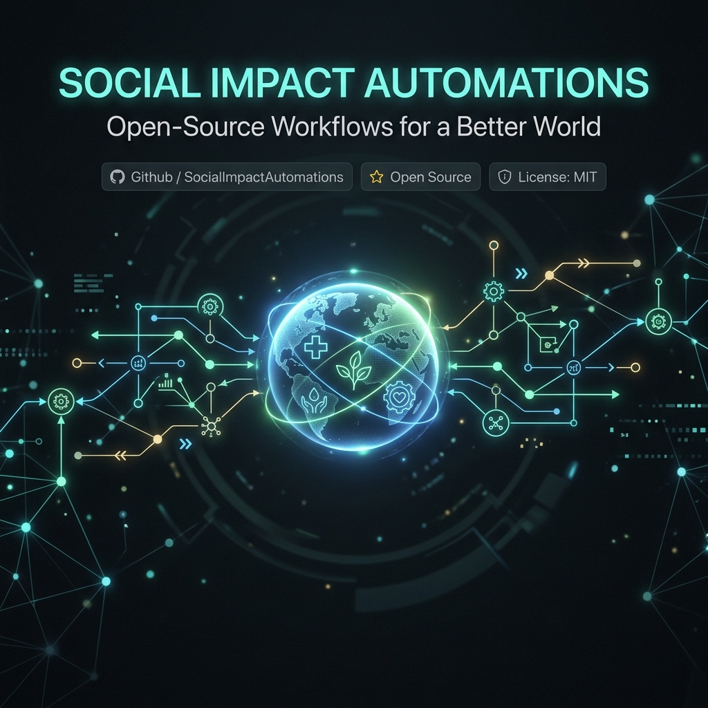

<div align="center">
  
  <br/><br/>
  
  # 🌍 n8n Social Impact Automation Templates
  
  **25 Enterprise-Grade Workflows for Non-Profits, Civic Tech, and Global Good**
  
  [](https://n8n.io/)
  [](https://github.com/avuzmal/social.impact.n8n)
  [](CONTRIBUTING.md)
  
</div>

<hr/>

## 📖 The Vision

In a world facing complex crises—from natural disasters to healthcare shortages—technology should be a force multiplier for those on the front lines. This repository provides **25 complex, ready-to-deploy n8n automation templates** designed specifically for high-impact social, environmental, and civic use cases. 

Stop wrestling with APIs. Start saving lives.

---

## ⚡ Quick Start

1. **Clone this repository**:
   ```bash
   git clone https://github.com/avuzmal/social.impact.n8n.git
   ```
2. **Open your n8n workspace**.
3. In a new or existing workflow, click the **Options** menu (top right) `>` **Import from File...**
4. Select any `.json` file from the `templates/` directory.
5. **Configure Credentials** & activate!

---

## 🗂️ Template Catalog

<details open>
<summary><b>🚨 Disaster Response & Emergency Management</b></summary>

| ID | Workflow Name | Description |
|:---|:---|:---|
| `01` | [Multi-Source Disaster Alert & Routing](templates/01-multi-source-disaster-alert-and-resource-routing.json) | Merges USGS/NOAA webhooks, uses AI for severity parsing, and routes SMS alerts to NGOs. |
| `02` | [Infrastructure Damage Triage](templates/02-post-disaster-infrastructure-damage-triage.json) | Ingests WhatsApp reports, uses Vision AI to estimate damage, and logs to GIS. |
| `03` | [Wildfire Evacuation & Pet Rescue](templates/03-wildfire-evacuation-and-pet-rescue-coordination.json) | Monitors NASA FIRMS, checks shelter capacity, and maps pet evacuation routes. |

</details>

<details open>
<summary><b>🏥 Healthcare & Mental Health</b></summary>

| ID | Workflow Name | Description |
|:---|:---|:---|
| `04` | [AI Crisis Triage & Routing](templates/04-ai-driven-mental-health-crisis-triage-and-routing.json) | Assesses crisis texts via LLM. Routes severe cases to PagerDuty, schedules follow-ups for others. |
| `05` | [Medication Shortage Early Warning](templates/05-medication-shortage-early-warning-and-redistribution.json) | Cross-references FDA shortage APIs with local inventory to predict and mitigate stockouts. |
| `06` | [Elderly Fall Detection Check](templates/06-elderly-fall-detection-and-autonomous-wellness-check.json) | Cascading fallback alerts (Voice > Text Neighbor > EMS dispatch) for smart-home motion alerts. |

</details>

<details open>
<summary><b>🍎 Food Security & Agriculture</b></summary>

| ID | Workflow Name | Description |
|:---|:---|:---|
| `07` | [Hyper-Local Food Waste Rescue](templates/07-hyper-local-food-waste-rescue-network.json) | Connects restaurant POS surplus with food banks and automatically dispatches delivery drivers. |
| `08` | [Smallholder Farmer Micro-Insurance](templates/08-smallholder-farmer-micro-insurance-payouts.json) | Triggers mobile money payouts automatically based on satellite drought data. |
| `09` | [Community Garden Allocation](templates/09-community-garden-resource-allocation.json) | Uses soil sensors & AI to recommend crop rotations and automatically orders seeds. |

</details>

<details open>
<summary><b>🌍 Environment & Sustainability</b></summary>

| ID | Workflow Name | Description |
|:---|:---|:---|
| `10` | [Deforestation Acoustic Triangulation](templates/10-illegal-deforestation-acoustic-triangulation.json) | Analyzes IoT audio for chainsaws and dispatches encrypted coordinates to rangers. |
| `11` | [Urban Air Quality Asthma Alert](templates/11-urban-air-quality-and-asthma-alert-system.json) | Monitors AQI, warns vulnerable individuals, and auto-adjusts local public school HVACs. |
| `12` | [Corporate ESG Carbon Auto-Trading](templates/12-corporate-esg-compliance-auto-trading.json) | Calculates corporate emissions in real-time and auto-purchases offset credits. |

</details>

<details>
<summary><b>🏛️ Civic Engagement & Govt Transparency</b></summary>

| ID | Workflow Name | Description |
|:---|:---|:---|
| `13` | [Legislative Bill Impact Analyzer](templates/13-legislative-bill-impact-analyzer-and-civic-digest.json) | Summarizes massive government bills via LLM and texts citizens personalized digests. |
| `14` | [Gamified Pothole Tracking](templates/14-pothole-gamified-reporting-and-tracking.json) | Verifies citizen issue reports via AI and issues transit credits as rewards. |
| `15` | [Public Fund Fraud Detection](templates/15-public-fund-allocation-fraud-detection.json) | Cross-references procurement winners with Shell Company/PEP registries. |

</details>

<details>
<summary><b>🎓 Education & Youth Development</b></summary>

| ID | Workflow Name | Description |
|:---|:---|:---|
| `16` | [Personalized IEP Generator](templates/16-ai-powered-personalized-iep-generator.json) | Drafts compliant special education plans and auto-schedules parent reviews. |
| `17` | [Dropout Prediction & Mentorship](templates/17-dropout-prediction-and-mentorship-matching.json) | Flags at-risk students from SIS data and automatically pairs them with community mentors. |
| `18` | [OER Localization](templates/18-open-educational-resource-(oer)-localization.json) | Formats and translates global open educational resources for SMS/low-bandwidth delivery. |

</details>

<details>
<summary><b>🏘️ Homelessness & Social Services</b></summary>

| ID | Workflow Name | Description |
|:---|:---|:---|
| `19` | [Shelter Bed Dynamic Matching](templates/19-rapid-rehousing-shelter-bed-matching.json) | Matches real-time shelter bed availability with specific client profiles instantly. |
| `20` | [Social Safety Net Navigator](templates/20-benefit-cliff-and-social-safety-net-navigator.json) | Uses an eligibility engine to auto-fill government aid applications. |
| `21` | [Mobile Clinic Route Optimization](templates/21-mobile-health-clinic-route-optimization.json) | Routes mobile health units dynamically based on local health data and weather. |

</details>

<details>
<summary><b>♿ Accessibility & Disability Support</b></summary>

| ID | Workflow Name | Description |
|:---|:---|:---|
| `22` | [Real-Time Sign Language Auditor](templates/22-real-time-sign-language-accessibility-event-auditor.json) | Captions video feeds and generates ASL avatars dynamically for public meetings. |
| `23` | [Adaptive Tech Loaner Coordination](templates/23-adaptive-technology-repair-and-loaner-coordination.json) | Matches broken accessibility devices with temporary loaners from local closets. |

</details>

<details>
<summary><b>🐘 Wildlife & Conservation</b></summary>

| ID | Workflow Name | Description |
|:---|:---|:---|
| `24` | [Human-Wildlife Conflict Warning](templates/24-human-wildlife-conflict-early-warning-system.json) | Triggers IoT lights and SMS warnings when GPS-collared predators approach villages. |
| `25` | [Marine Plastic Cleanup Dispatch](templates/25-marine-plastic-tracking-and-cleanup-fleet-dispatch.json) | AI prediction of plastic accumulation zones to optimize ocean cleanup ship routing. |

</details>

<br/>

## 🛠️ Built With

- **n8n**: The fairest source-available workflow automation tool.
- **AI Integrations**: OpenAI, AWS Rekognition, AWS Transcribe.
- **Communication APIs**: Twilio, Telegram, WhatsApp, Slack.
- **Data Layers**: Postgres, MySQL, Airtable, OpenStreetMap, NASA FIRMS, USGS.

---

## 🤝 Contributing

We welcome contributions to expand this library! Whether it's adding new templates, fixing bugs, or improving documentation, your help makes a difference.

1. Fork the Project
2. Create your Feature Branch (`git checkout -b feature/AmazingFeature`)
3. Commit your Changes (`git commit -m 'Add some AmazingFeature'`)
4. Push to the Branch (`git push origin feature/AmazingFeature`)
5. Open a Pull Request

---

<div align="center">
  <sub>Built with ❤️ by the community, for the community. Let's automate for good.</sub>
</div>
